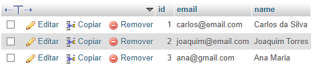
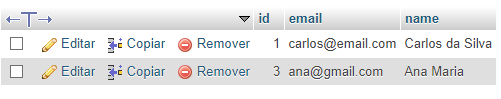

# Seção 21: Java EE - Mapeamento objeto-relacional com JPA / Hibernate - Curso JAVA COMPLETO

## JPA class: Persisting, searching and deleting data with jpa / hibernate. The data was persisted in the MySQL database with XAMPP.

## Persisting data with jpa

## Deleting data with jpa
